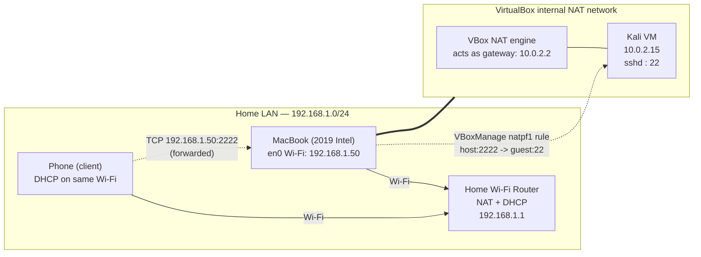

# Kali-on-VirtualBox SOHO Lab: Build, Network, and Troubleshoot

A beginner-friendly, step-by-step writeup of standing up a Kali Linux VM on a
2019 Intel MacBook under VirtualBox, exposing it over the home network with a
NAT port forward, and fixing the networking bug that broke it — written so
anyone new to Packet Tracer / networking / VirtualBox can follow along and
understand **why** each step was taken, not just **what** was typed.

This mirrors a real SOHO (Small Office/Home Office) topology: a home router
doing NAT/DHCP for the LAN, a "server" host (the Mac) that itself runs a
second NAT layer (VirtualBox's internal NAT engine) for a guest VM, and a
client (a phone) trying to reach a service on that guest from across the LAN.
That double-NAT shape is extremely common in real SOHO and lab networks, and
is exactly why the port forward needed troubleshooting.

---

## Topology



Two separate NAT boundaries exist here:

1. **Router NAT** — translates the whole home LAN to/from the ISP (not
   touched in this lab, shown for completeness).
2. **VirtualBox NAT** — translates the Mac's single network connection into a
   private `10.0.2.0/24` network that only the VM can see. The VM gets
   `10.0.2.15` and treats `10.0.2.2` as its gateway. **Nothing on the LAN can
   reach `10.0.2.15` directly** — that's the entire reason a port forward is
   needed.

---

## Why VirtualBox NAT + a port forward (instead of Bridged networking)

VirtualBox offers a few networking modes. This lab used **NAT**, the
default, because:

- It needs zero router configuration and works on any Wi-Fi network
  (coffee shops, locked-down networks, etc.) since the VM is invisible from
  the outside by default.
- The tradeoff: because the VM is hidden behind that private `10.0.2.x`
  network, you must explicitly **forward** any port you want reachable from
  outside the Mac — hence the SSH forward below.
- The alternative, **Bridged** networking, would put the VM directly on the
  `192.168.1.0/24` LAN with its own DHCP lease — simpler to reach, but it
  also exposes the VM directly to the whole LAN and depends on the host's
  physical adapter being bridgeable (not always available on Wi-Fi).

For a single forwarded service (SSH) on a home network, NAT + port-forward
is the safer, more portable default — which is why the `natpf1` approach
below was used instead of switching network modes.

---

## Step-by-step walkthrough

### 1. Disk space triage (before touching anything)

**What:** Checked `df -h /` (16 GiB free), then sized three deletion
candidates with `du -sh`:

| Item | Size | Action | Why |
|---|---|---|---|
| `~/Library/Roblox` | 2.3 GB | Deleted (user confirmed) | Unused app cache |
| `~/thinkorswim` | 1.7 GB | Deleted (user confirmed) | Unused app data |
| `CiscoPacketTracer_901_macOS_64bit.dmg` | 455 MB | **Kept** | Condition was "delete only if already installed" — it wasn't, so the rule said leave it |

**Why ask first:** deleting user data is irreversible from the CLI (no
Trash/undo via `rm`). Each candidate was confirmed individually before
removal.

**Result:** 16 GiB → 20 GiB free.

> **Methodology point:** always re-check the stated *condition* for a
> destructive action, not just the action itself. "Delete the dmg if X is
> installed" is not the same instruction as "delete the dmg."

### 2. Install 7-Zip (needed to extract the VM image)

```bash
brew install sevenzip
```

Homebrew had no pre-built bottle for this older Intel macOS version (a
"Tier 3" config), so it compiled from source — slower, but it worked. The
resulting binary is named **`7zz`**, not `7z` — worth knowing, since most
online examples assume `7z`.

### 3. Check uncompressed size *before* extracting

This is the step most tutorials skip, and it's the one that prevents a
filled disk mid-extraction.

```bash
7zz l kali-linux-2026.2-virtualbox-amd64.7z
```

The listing reports both the compressed size on disk (3.7 GB) and the
**uncompressed** size the files will occupy once extracted
(16,168,325,059 bytes ≈ **15.07 GiB** — almost all of it one `.vdi` virtual
disk file). Compressed size tells you nothing about whether you have enough
room; uncompressed size does.

**Safety check performed:** 20 GiB free − 15.07 GiB extracted ≈ 4.9 GiB
remaining — above the 3 GB floor set for this task, so extraction was
allowed to proceed. If it had come out under 3 GB, the task was to stop and
ask, not extract anyway.

```bash
7zz x kali-linux-2026.2-virtualbox-amd64.7z -aoa
```

Extraction produced `kali-linux-2026.2-virtualbox-amd64.vdi` (15 GB) and a
`.vbox` machine-definition XML (a few KB) in a sibling folder.

> **Gotcha hit during this lab:** the extraction was first launched as
> `7zz x ... &` *inside* a command that was already being run in the
> background by the tool harness. That double-backgrounds the process: the
> wrapper shell exits immediately (reporting "done") while the real `7zz`
> process keeps running, detached and unmonitored. It was caught by
> noticing the output directory was still empty and free space hadn't
> moved, then confirmed with `ps aux | grep 7zz` (still running) and
> `du -sh` on the output folder (partially filled). The fix was to launch it
> as a normal foreground-tracked background task and poll for the actual
> process to exit, rather than trusting the first "completed" signal.
> **Lesson:** never add a trailing `&` to a command that a tool is already
> backgrounding for you — verify completion against real evidence (process
> list, output size, exit markers in a log), not just a status flag.

### 4. Delete the archive (after confirming extraction succeeded)

Checked `7zz`'s own integrity line — "Everything is Ok" — before asking to
delete the now-redundant 3.7 GB `.7z`. Freed space: 4.0 GiB → 8.7 GiB.

**Why ask again here, separately from step 1:** this is a second,
independent destructive action gated by a *different* precondition
("only after extraction succeeds") — collapsing it into the earlier
approval would have deleted the only copy of the data before confirming the
extracted copy was good.

### 5. Register the VM and size its resources

```bash
VBoxManage registervm ~/Downloads/kali-linux-2026.2-virtualbox-amd64/kali-linux-2026.2-virtualbox-amd64.vbox
VBoxManage modifyvm "kali-linux-2026.2-virtualbox-amd64" --memory 3072 --cpus 2
VBoxManage startvm "kali-linux-2026.2-virtualbox-amd64"
```

`registervm` points VirtualBox at the exported `.vbox` XML (machine
definition + disk reference) so it shows up in `VBoxManage list vms`.
`modifyvm` overrides the exported defaults (2048 MB / 2 CPU) with the
requested 3072 MB / 2 CPU — verified afterward with:

```bash
VBoxManage showvminfo "kali-linux-2026.2-virtualbox-amd64" | grep -E "^Memory size|^Number of CPUs"
```

### 6. Add a NAT port forward for SSH — first attempt (broken)

```bash
VBoxManage controlvm "kali-linux-2026.2-virtualbox-amd64" natpf1 "ssh,tcp,127.0.0.1,2222,,22"
```

Rule syntax: `name,protocol,host-ip,host-port,guest-ip,guest-port`. This
rule *looked* correct and the command exited `0`, but **specifying
`127.0.0.1` as the host IP tells VirtualBox to bind the listening socket
only to the loopback interface** — reachable from the Mac itself, invisible
to anything else on the LAN, including a phone on the same Wi-Fi.

### 7. Troubleshooting methodology: "Connection refused" from the phone

This is the reusable part — the same four-step method applies to almost any
"service X is unreachable from device Y" problem:

1. **Reproduce and localize** — phone got `Connection refused` hitting
   `192.168.1.50:2222`. "Refused" (vs. a timeout) already tells you *something*
   is listening and actively rejecting — i.e., this is a reachability/binding
   problem on the host, not a dead service or a firewall silently dropping
   packets.
2. **Inspect what's actually listening, on the host, with ground truth
   (not config files):**
   ```bash
   lsof -nP -iTCP:2222 -sTCP:LISTEN
   ```
   Output showed:
   ```
   VirtualBo ... TCP 127.0.0.1:2222 (LISTEN)
   ```
   `127.0.0.1:2222` is the smoking gun — the socket is bound to loopback
   only, confirming the hypothesis from step 6 directly from the kernel's
   socket table rather than trusting the `VBoxManage` command's exit code.
3. **Fix the root cause, don't work around it** — delete the misconfigured
   rule and re-add it with the host-IP field left **blank**, which tells
   VirtualBox to bind on all interfaces (wildcard):
   ```bash
   VBoxManage controlvm "kali-linux-2026.2-virtualbox-amd64" natpf1 delete "ssh"
   VBoxManage controlvm "kali-linux-2026.2-virtualbox-amd64" natpf1 "ssh,tcp,,2222,,22"
   ```
4. **Re-verify against the same ground truth you used to diagnose it** —
   don't just assume the fix worked:
   ```bash
   lsof -nP -iTCP:2222 -sTCP:LISTEN
   ```
   ```
   VirtualBo ... TCP *:2222 (LISTEN)
   ```
   `*:2222` confirms the socket now accepts connections on every interface,
   including the Wi-Fi adapter the phone can reach.

**General troubleshooting checklist this maps onto** (useful for any
SOHO/NAT networking problem, Packet Tracer labs included):

- [ ] Is the symptom a **timeout** (packet dropped/filtered somewhere in
      transit) or a **refusal** (reached the host, but nothing accepted
      the connection on that port)? These point to completely different
      layers of the problem.
- [ ] What does the **host itself** say is listening, and on which
      address? (`lsof`, `netstat -an`, `ss -tlnp` on Linux)
- [ ] Does the forwarding/NAT rule's bind address match where the client
      actually sits (loopback vs. LAN vs. all-interfaces)?
- [ ] Is a host firewall (macOS Application Firewall, `ufw`, etc.) also in
      the path, independent of the NAT rule?
- [ ] Re-test from the same vantage point you started from (the phone, on
      the LAN) — not just from the host — since "works from localhost" and
      "works from the LAN" are different claims.

### 8. Reinstalling Cisco Packet Tracer

```bash
hdiutil attach ~/Downloads/CiscoPacketTracer_901_macOS_64bit.dmg -nobrowse
open "/Volumes/Cisco Packet Tracer 9.0.1/PacketTracer901_installer.app"
```

The installer is a Qt Installer Framework wizard (not a simple drag-to-
`/Applications` `.app`), so it had to be driven interactively — license
agreement, install location, admin password for writing to `/Applications`,
and (on first run) a free Cisco NetAcad/Skills for All login.

---

## Final verified state

| Item | Value |
|---|---|
| VM name | `kali-linux-2026.2-virtualbox-amd64` |
| Memory / CPUs | 3072 MB / 2 |
| Guest network | NAT, guest IP `10.0.2.15`, gateway `10.0.2.2` |
| Port forward | Mac `*:2222` (tcp) → guest `22` |
| Host Wi-Fi IP | `192.168.1.50` (`en0`) |
| Free disk space (`/`) | ~7.7 GiB |

From the phone: `ssh -p 2222 kali@192.168.1.50` (default creds `kali`/`kali`
— **change these immediately**, see Security notes below).

---

## Suggested companion Packet Tracer lab

Since Packet Tracer is now installed, the exact same concept — a NAT device
hiding an inside host, with a static/port-forward rule poking one hole in
it — can be rebuilt and visualized there for practice:

1. Place a **Router** (acting as the home router), a **Switch**, a **Server**
   (standing in for the Kali VM), and a **PC** or **Laptop** (standing in
   for the phone).
2. Configure the router's outside interface with a "public-ish" address and
   the inside interface on a private subnet (e.g. `10.0.2.0/24`), mirroring
   the Mac/VirtualBox-NAT boundary.
3. Enable NAT on the router and add a **static NAT / port-forward** entry
   for TCP/22 pointing at the Server's inside address — this is the Cisco
   IOS equivalent of the `natpf1` rule used above.
4. From the PC, attempt an SSH connection to the router's outside address on
   port 22 (or a translated port) and confirm it reaches the Server.
5. Deliberately misconfigure the static NAT (wrong inside IP, or omit it)
   and reproduce a Packet Tracer-visible version of the same "Connection
   refused" symptom, then walk through the same four-step methodology from
   step 7 above using `show ip nat translations` / `show running-config`
   in place of `lsof`.

This turns the real troubleshooting story above into a repeatable, visual
teaching lab — good onboarding material for anyone new to NAT.

---

## Security notes (read before exposing this to a real network)

- The Kali VM's default credentials (`kali`/`kali`) are public knowledge —
  change the password before leaving SSH reachable from the LAN.
- A port forward on a home router's Wi-Fi is reachable by anything else
  that joins that Wi-Fi (guests, IoT devices, a compromised device, etc.).
  Treat "reachable from my phone" as "reachable from everything on this
  network."
- This writeup is for a personal/lab environment. Don't forward VM SSH
  ports on networks you don't fully control, and never forward this kind of
  rule on a router's *WAN* side without understanding the exposure.
- All IP addresses in this note are illustrative example addresses
  (`192.168.1.50` stands in for the actual host IP used during this lab) —
  only the VirtualBox-internal NAT defaults (`10.0.2.2` / `10.0.2.15`, fixed
  by VirtualBox for every user) are real.

---

## Self-check

- Why does a VM on VirtualBox NAT need a port forward to be reachable from
  another device on the LAN, when a device using Bridged networking
  wouldn't?
- A port forward rule's host-IP field is set to `127.0.0.1` instead of left
  blank. What's reachable, and what isn't?
- Given a "Connection refused" (not a timeout) from a remote client, what
  does that tell you about where in the path the problem likely is, and
  what's the first command you'd run on the host to confirm it?
- Why check `7zz l <archive>` for the *uncompressed* size before extracting,
  instead of relying on the archive's size on disk?
- In the suggested Packet Tracer lab, what IOS command is the equivalent of
  checking `lsof` output when a static NAT entry isn't working?
